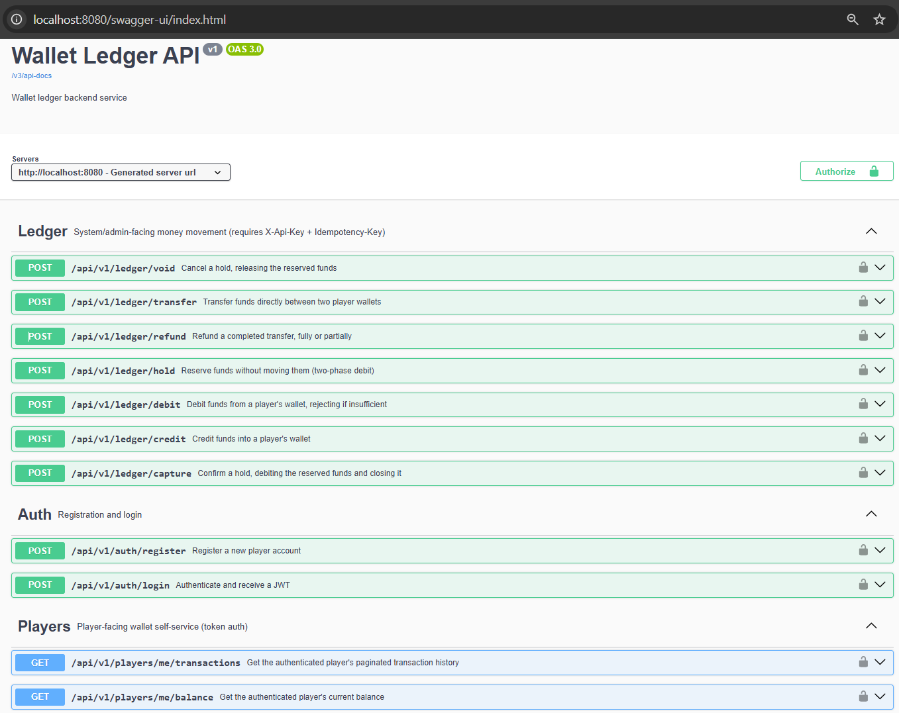

# Wallet Ledger

A double-entry wallet ledger backend (Java 17 + Spring Boot): credit/debit/hold/capture/void, direct player-to-player transfers, a signup bonus, and refunds — all crash-safe and race-safe by construction, not by convention.

## Core Concept

- Every `Transfer` writes exactly two `Entry` records (one debit-signed, one credit-signed) across two accounts.
- The system enforces `sum(entries.amount) == 0` per transfer, both at the application layer and as a DB-level backstop — or the write is rejected.
- Balances (`accounts.balance`/`held`) are **stored, maintained columns**, updated in the same transaction as the entries — not derived via `SUM(entries)` on every read. O(1) reads on the hot balance-check path; `entries` is kept for history/audit, not for computing the current balance.
- All entries are append-only. Corrections happen via **reversal** (`refund`), never `UPDATE`/`DELETE` of the original.

## How to run

**Prerequisites**: Docker + Docker Compose, or JDK 17 + Maven (the repo ships `./mvnw`, so a local Maven install isn't required).

**Full stack** (Postgres + app, Flyway migrates automatically):
```bash
docker-compose up -d
```
API is then live at `http://localhost:8080`, Swagger UI at `http://localhost:8080/swagger-ui.html`.



**App only, Postgres in Docker**:
```bash
docker-compose up -d postgres
./mvnw spring-boot:run
```

**Tests**:
```bash
./mvnw test                                        # unit — no DB, no Docker
./mvnw failsafe:integration-test failsafe:verify   # integration — real Postgres via Testcontainers
```
If Testcontainers can't reach Docker on your machine, use the bundled escape hatch instead (no code changes needed):
```bash
docker compose -f docker-compose.test.yml up -d
IT_DB_URL=jdbc:postgresql://localhost:5433/wallet_ledger_test ./mvnw failsafe:integration-test failsafe:verify
docker compose -f docker-compose.test.yml down
```

**Try it** — a `root`/`123456` admin and a seeded API key (`dev-service-api-key-change-me`) are created on first startup:
```bash
# Register + log in as a player (first login also grants a 100 COINS signup bonus)
curl -X POST http://localhost:8080/api/v1/auth/register -H "Content-Type: application/json" \
  -d '{"username": "alice", "password": "password123"}'
curl -X POST http://localhost:8080/api/v1/auth/login -H "Content-Type: application/json" \
  -d '{"username": "alice", "password": "password123"}'   # -> { token, user }

# Player self-service (Authorization: Bearer <token>)
curl http://localhost:8080/api/v1/players/me/balance -H "Authorization: Bearer <token>"

# System/admin money movement (X-Api-Key + Idempotency-Key required)
curl -X POST http://localhost:8080/api/v1/ledger/debit -H "X-Api-Key: dev-service-api-key-change-me" \
  -H "Idempotency-Key: <uuid>" -H "Content-Type: application/json" \
  -d '{"account_id": "<id>", "amount": 100, "type": "PURCHASE"}'
```
See [API Endpoints](#api-endpoints) below for the full surface, or [docs/01-api-list.md](docs/01-api-list.md) for exact request/response shapes.

## Tech Stack

- **Java 17**
- **Spring Boot 3.3.5**
- **Spring Data JPA**: persistence layer (Hibernate as the JPA provider)
- **PostgreSQL**: primary datastore
- **Flyway**: versioned schema migrations — hand-written DDL is the source of truth; Hibernate only validates (`ddl-auto=validate`)
- **Spring Security**: JWT for players, API-Key (`X-Api-Key`) for system/service callers, `@PreAuthorize` per endpoint
- **Lombok**: boilerplate reduction
- **Spring Validation**: request-level input validation
- **MapStruct**: compile-time DTO ↔ Entity mapping
- **springdoc-openapi**: Swagger UI / OpenAPI documentation
- **Testcontainers**: real Postgres in integration tests
- **Maven**: build tool

## Architecture

The codebase is organized by domain (bounded context), not by technical layer:

```
com.walletledger
├── domain
│   ├── user          # User entity, repository, AuthController/Service, UserController, dto/, mapper/
│   ├── account       # Account entity, AccountRepository (pessimistic row locking)
│   ├── ledger        # Transfer/Entry/Hold, LedgerService/Controller, dto/, mapper/
│   ├── player        # PlayerController (balance, transaction history)
│   ├── reward        # RewardProgram lookup (signup bonus)
│   ├── outbox        # OutboxEvent, publisher, @Scheduled poller
│   └── reconciliation # independent ledger re-verification, scheduled + on-demand
├── infrastructure/security
│   ├── jwt           # JwtService, JwtAuthenticationFilter, JwtProperties
│   └── apikey        # ApiClient, ApiKeyAuthFilter (X-Api-Key -> ROLE_SERVICE)
├── config            # SecurityConfig, SchedulingConfig, OpenApiConfig, seeders
├── shared            # GlobalExceptionHandler, ApiResponse<T> envelope
└── WalletLedgerApplication
```

### Domain Model

| Entity | Description |
|---|---|
| `User` | Identity that authenticates and owns a wallet `Account`. Role (`CUSTOMER`/`ADMIN`/`AUDITOR`) and status (`ACTIVE`/`SUSPENDED`). |
| `Account` | A wallet. `PLAYER` (one per user) or `SYSTEM` (the ledger's treasury counterparty, exempt from the non-negative balance check). Stores `balance` and `held`. |
| `Transfer` | One money-movement event — exactly one per credit/debit/capture/refund, with a `type`, `status`, `reference_id`, and `idempotency_key`. |
| `Entry` | A signed debit/credit line against an account, tied to a `Transfer`. Always created in balanced pairs. Immutable — no update/delete path. |
| `Hold` | A two-phase reservation against an account's `held` balance — `capture`s into a real debit, or `void`s/expires back to available. |
| `RewardProgram` | A named, amount-bearing bonus (e.g. `signup-bonus-v1`), credited through the same `LedgerService.credit` path as everything else. |
| `OutboxEvent` | A side-effect record (audit/notification) written in the same transaction as its business write; drained by a scheduler. |

## API Endpoints

| Method | Endpoint | Description |
|---|---|---|
| `POST` | `/api/v1/auth/register` | Register a new player |
| `POST` | `/api/v1/auth/login` | Authenticate, returns a JWT (first login also grants the signup bonus) |
| `GET` | `/api/v1/users/me` | Get the authenticated user's profile |
| `GET` | `/api/v1/players/me/balance` | Get the authenticated player's balance (available/hold/total) |
| `GET` | `/api/v1/players/me/transactions` | Get the authenticated player's paginated transaction history |
| `POST` | `/api/v1/ledger/credit` | Credit funds into a player's wallet *(system/admin, `Idempotency-Key`)* |
| `POST` | `/api/v1/ledger/debit` | Debit funds from a player's wallet, rejects if insufficient *(system/admin, `Idempotency-Key`)* |
| `POST` | `/api/v1/ledger/hold` | Reserve funds without moving them, two-phase debit *(system/admin, `Idempotency-Key`)* |
| `POST` | `/api/v1/ledger/capture` | Confirm a hold, debiting the reserved funds *(system/admin, `Idempotency-Key`)* |
| `POST` | `/api/v1/ledger/void` | Cancel a hold, releasing the reserved funds *(system/admin)* |
| `POST` | `/api/v1/ledger/refund` | Refund a completed transfer, fully or partially *(system/admin, `Idempotency-Key`)* |
| `POST` | `/api/v1/ledger/transfer` | Transfer funds directly between two player wallets, no `SYSTEM` account involved *(system/admin, `Idempotency-Key`)* |
| `GET` | `/api/v1/admin/reconciliation` | Independently re-verify the ledger on demand — entries sum to zero, no account balance drift *(admin)* |

## Data Flow — Peer-to-peer Transfer

The most representative case: money moving between two players. Every other ledger operation (`credit`/`debit`/`hold`/`capture`/`refund`) follows the same shape — validate → lock in order → re-check → mutate → commit — with `SYSTEM` standing in as one side instead of two real players.

```
POST /api/v1/ledger/transfer
Headers: X-Api-Key: <service-key>, Idempotency-Key: k1
Body:    {
           "from_account_id": "0b1e2f3a-4c5d-4e6f-8a9b-1234567890ab",  // alice's wallet
           "to_account_id":   "1c2d3e4f-5a6b-4c7d-8e9f-0987654321ba",  // bob's wallet
           "amount": 250
         }

Client
  │
  ▼
LedgerController.transfer()
  │  @Valid — amount > 0, both account ids present → 400 if not
  ▼
LedgerService.transfer()
  │
  ├── findByIdempotencyKey("k1") — already exists? ──▶ return that Transfer as-is, nothing re-run
  │         │ not found
  ▼
BEGIN transaction (TransactionTemplate)
  │
  ├── from_account_id == to_account_id? ──────────────▶ 400
  ├── resolve currency (defaults to COINS)
  │
  ├── lock both accounts — SELECT ... FOR UPDATE, sorted by account id
  │     (not "from, then to" — id order, so two transfers racing in
  │     opposite directions can't deadlock each other)
  │
  ├── either account is SYSTEM? ───────────────────────▶ 400 (use credit/debit instead)
  ├── sender's available balance (balance − held) < amount? ──▶ 409
  │
  ├── insert transfer (type=TRANSFER, idempotency_key='k1')
  │     └── UNIQUE(idempotency_key) collision (concurrent retry) ──▶ catch,
  │           re-fetch by key, return the original — same 201, no double-move
  ├── insert entry (alice, -250)
  ├── insert entry (bob,   +250)
  ├── update accounts.balance (both)
  └── insert outbox_events (status=PENDING, type=TRANSFER_COMPLETED)
  │
  ▼
COMMIT
  │  deferred trigger re-checks: this transfer's entries SUM(amount) = 0,
  │  or the whole COMMIT fails — DB-level backstop behind the checks above
  ▼
201 Created ──▶ Client

Meanwhile, asynchronously:
OutboxEventScheduler (@Scheduled, every 5s)
  │
  ├── SELECT ... WHERE status='PENDING' FOR UPDATE SKIP LOCKED
  └── mark PROCESSED
        │
        ▼  ── PLANNED, not implemented yet — see Task List ──
      Kafka
        │
        ▼
  Reward / Notification / etc.
```

`from_account_id`/`to_account_id` are `Account.id` — a server-generated UUID string (`GenerationType.UUID`), never a username or a number. A player's own wallet id isn't currently returned by `GET /players/me/balance` (only available/hold/total); today a service caller gets it from a prior `TransferResponse`'s `from_account_id`/`to_account_id`, or directly from the DB — exposing it on that endpoint is a reasonable, small follow-up if callers keep needing to look it up.

See [LedgerController.java](src/main/java/com/walletledger/domain/ledger/LedgerController.java) and [LedgerService.java](src/main/java/com/walletledger/domain/ledger/LedgerService.java) for the actual code this diagram traces.

## Correctness & Concurrency Guarantees

- **Balanced-transaction invariant**: a transfer's entries must sum to zero — checked at the application layer, and backstopped by a `DEFERRABLE` DB constraint trigger that re-verifies at `COMMIT`, so even a future application bug can't silently unbalance the books.
- **Idempotency keys**: every mutating `POST /api/v1/ledger/*` call requires an `Idempotency-Key` header, backed by a DB `UNIQUE` constraint — a retried request returns the original result instead of double-processing.
- **Atomicity**: each operation (credit/debit/hold/capture/void/refund/transfer) is one transaction — accounts locked in a fixed `id`-sorted order (deadlock-free), re-checked, then mutated; if any step fails, nothing commits.
- **Append-only entries**: no `UPDATE`/`DELETE` path on `entries`/`transfers`. Corrections happen via `POST /api/v1/ledger/refund`, which creates new offsetting entries rather than touching the original transfer.
- **Database-level constraints**: `CHECK` constraints (non-negative balance except `SYSTEM`, `held <= balance`, valid enum values) and `UNIQUE` (idempotency keys) act as a second line of defense beyond the application-level checks.
- **Reconciliation as a belt-and-suspenders layer**: the Phase 2.5 trigger only watches `entries`, so it can't see a direct `UPDATE accounts.balance` that never touches them. `ReconciliationService` independently recomputes every account's balance from `entries` and compares — run hourly by `ReconciliationScheduler`, and on demand via `GET /api/v1/admin/reconciliation`.
- **Lock ordering, not lock avoidance**: accounts are always locked in a fixed `id`-sorted order, regardless of which one is logically "from" or "to" — this, not the locks themselves, is what prevents a classic deadlock (transaction A locking X then Y while B locks Y then X at the same time).
- **`TransactionTemplate`, not `@Transactional` self-invocation**: a duplicate `Idempotency-Key` aborts the whole transaction at the DB level, so the fallback "fetch the existing row" has to run in a *fresh* transaction — self-invocation can't give you that, since Spring's proxy is bypassed on an internal method call.

The signup bonus reuses this same idempotency mechanism rather than a separate "already granted" flag: login always calls `credit(..., idempotencyKey="signup-bonus:"+userId)`, so only the first call ever inserts.

## Design decisions

- **Double-entry, not a mutable balance column** — `Transfer` + 2 signed `Entry` rows, never an in-place `UPDATE`; the audit trail can't disagree with the balance by construction.
- **Balance is stored, not derived** — O(1) read on the hot balance-check path instead of `SUM(entries)` per request; drift is covered by reconciliation, not just "same transaction" discipline.
- **`SYSTEM` accounts as the ledger's counterparty** — double-entry needs two sides even for "credit from nowhere" (a bonus) or "debit to nowhere" (a purchase).
- **`holds` for two-phase reservations** — raises `held` without touching `balance`; `capture`/`void`/expiry settle or release it, so "reserve now, charge later" never double-spends.
- **Refund is a reversal, never an edit** — a new offsetting `Transfer(type=REFUND)`; "already refunded" is computed on demand, not stored.
- **Peer-to-peer transfer reuses the same machinery, not a special case** — same locking/idempotency/outbox path as `credit`/`debit`, just with both accounts supplied explicitly instead of `SYSTEM` on one side.
- **Trade-off accepted throughout**: more inserts per operation than a single `UPDATE` — the goal is auditability and correctness under concurrency, not raw throughput.

Full reasoning and rejected alternatives: [docs/04-design-decisions.md](docs/04-design-decisions.md).

## Testing approach

Unit (fast, no DB) and integration (real Postgres, nothing stubbed or mocked) tiers, run separately in CI — unit fails fast before integration runs.

**Correctness under normal use**
- Every ledger operation (credit/debit/hold/capture/void/refund/transfer): happy path, insufficient-balance rejection, invalid input.
- Full auth flow (register/login/bonus/token), paginated history, admin endpoint role-gating.

**Protected under pressure**
- **Concurrent debit race** — two threads debit the same account's full balance at the same instant; exactly one succeeds, the other is rejected, balance never goes negative. Proves the row lock enforces it, not just the app-level check.
- **Concurrent idempotency** — 5 threads fire the identical request simultaneously; exactly one transfer is ever created.
- **Concurrent transfers** — 20 concurrent transfers between two accounts; the ledger is independently re-verified as still balanced afterward (entries sum to zero, no balance drift).
- **Deliberate corruption** — an account balance is corrupted directly in the DB, bypassing the service layer entirely; reconciliation catches it, proving the safety net actually works rather than just existing. That same check runs hourly in the background (`ReconciliationScheduler`) and on demand (`GET /api/v1/admin/reconciliation`) — not just in the test.

**Planned, not yet implemented**
- **k6, doing double duty**: `check()`-based black-box smoke tests (real HTTP against a running instance, golden-path + expected-failure scenarios — e.g. register → login → transfer → over-transfer that should `409`) and load testing (throughput/latency under sustained concurrency)
- Property-based testing (random operation sequences + invariant checks) instead of only hand-picked cases.

## Assumptions & limitations

- **`root`/`123456`** and the seeded service API key (`dev-service-api-key-change-me`) are known dev-only credentials — must be rotated before any real deployment; no rotation tooling is provided.
- **Single currency** (`COINS`) throughout — multi-currency would mean per-currency `SYSTEM` accounts and FX handling, neither designed here.
- **Admin/audit-log HTTP surface is minimal** — `GET /api/v1/admin/reconciliation` is the only `/admin/*` endpoint so far; user management and audit-log browsing (every mutation *is* permanently recorded, just not queryable via HTTP yet) are still direct DB/SQL access.
- **Outbox has no real consumer** — `OutboxEventScheduler` marks events `PROCESSED` as a stub extension point; wiring it to an actual message bus/notification service is future work.
- **Refund isn't restricted to `PURCHASE`** by type — any `COMPLETED`, non-`REFUND` transfer can be reversed. This is intentionally general, but means a refund whose reversed direction lands on a `PLAYER` account (not the usual `SYSTEM`) is subject to the same insufficient-balance check a debit gets.
- **Testcontainers can be unreliable on some local Docker Desktop setups** (seen during development on Windows) — CI is unaffected, and the `docker-compose.test.yml` / `IT_DB_URL` escape hatch above covers local dev when that happens.

## Task List

### Done
- [x] User registration & JWT login, role-based access (player JWT vs. system/service API key)
- [x] Double-entry ledger core: credit / debit / hold / capture / void
- [x] Player balance and paginated transaction history endpoints
- [x] Idempotency via DB `UNIQUE` constraint, verified sequentially and concurrently
- [x] Pessimistic row locking with deadlock-free ordering, verified with a concurrent-debit race test
- [x] Transactional outbox for audit/notification side-effects
- [x] Hold-expiry background scheduler
- [x] DB-level constraint trigger backstopping the double-entry invariant
- [x] Signup bonus reward program
- [x] Transaction refund, full and partial
- [x] Direct player-to-player transfer (no `SYSTEM` account involved)
- [x] Ledger reconciliation — scheduled + on-demand admin endpoint, catches balance drift the DB trigger can't see
- [x] Dockerized app + Postgres (`docker-compose`), Flyway-managed schema
- [x] Unit + integration test suites (Surefire/Failsafe, Testcontainers)
- [x] CI/CD pipeline (GitHub Actions), two-tier and path-filtered
- [x] Local test escape hatch (`docker-compose.test.yml` + `IT_DB_URL`) for environments where Testcontainers is unreliable
- [x] Swagger / OpenAPI documentation

### Planned
- [ ] k6 black-box smoke tests + load testing — functional `check()`-based scenarios against a running instance, and throughput/latency under realistic concurrency, in one tool
- [ ] Redis caching layer for read-heavy endpoints (balance/history) to reduce DB load at scale
- [ ] Kafka (or another broker) as the real outbox consumer, replacing the stub scheduler
- [ ] WebSocket push for real-time balance/transaction updates — last-mile delivery for outbox events (`TRANSFER_COMPLETED`, etc.) to a connected player, instead of the client polling `/players/me/balance`
- [ ] Admin/audit-log HTTP surface (`/admin/*` — user management, audit log browsing)
- [ ] Multi-currency support (per-currency `SYSTEM` accounts, FX handling)
- [ ] Observability: structured logging, metrics/tracing (e.g. Micrometer + Prometheus/Grafana)
- [ ] Rate limiting / abuse protection on public auth endpoints
- [ ] API key rotation & per-client scoping, instead of one shared service key
- [ ] Credential rotation tooling for the seeded admin account

## AI Tooling Notes

- **~50% of the time was spent talking with AI(Claude, ChatGPT, Gemini) before writing any code** — brainstorming and locking in tech-stack decisions, then writing the phase-by-phase plan and design rationale into `docs/`.
- **Claude implemented each phase against that plan**; code was reviewed and manually tested after every phase before moving to the next.
- **`.claude/` holds project-specific tooling**, committed alongside the code: a `verify` skill for the local test run, `/context-prime` and `/new-ledger-operation` commands, and 6 reviewer subagents scoped to this project's actual correctness/performance/security concerns rather than generic advice.
- **Used Claude Code's remote-control mode** to keep implementation moving in the background while away from the keyboard.
- **For sustained, longer-term development**, worth adopting a structured-workflow plugin such as [superpowers](https://github.com/obra/superpowers) — it formalizes the same brainstorm → plan → implement → review loop this project already followed by hand, via the Claude Code plugin marketplace.
